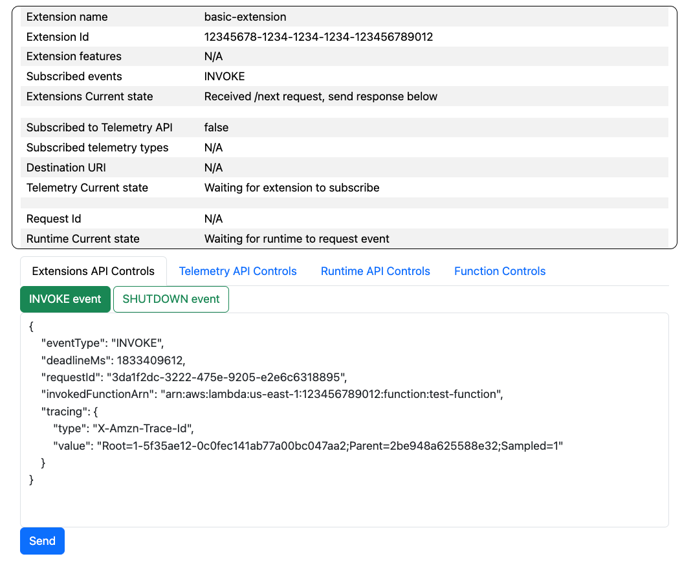
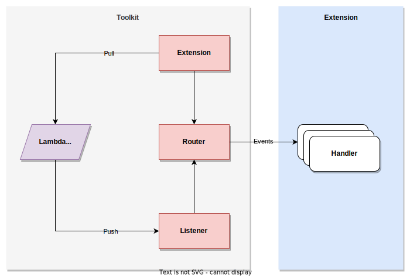

# Toolkit for AWS Lambda Extensions
This toolkit offers the easiest and fastest approach to developing [AWS Lambda Extensions](https://docs.aws.amazon.com/lambda/latest/dg/lambda-extensions.html). 

## Local Builder
With [Local Builder](local-builder) you can develop, test and troubleshooting your Lambda Extensions in your local environment.

## Library
The library provides building blocks for developing Lambda Extensions. No more _[boilerplate code](https://aws.amazon.com/what-is/boilerplate-code/)_ when developing extensions!

### Usage
Please, check the specific version for detailed usage including:

- [Node.JS](nodejs/README.md)

### Architecture
Through event-driven approach you can select which event types your extension needs and bind them to your custom handlers.  

### Features Roadmap

| Feature       | Node.js |
|---------------|---------|
| Extension API | ✔︎      |
| Telemetry API | ✔︎      |
| Proxy         | ✔︎      |

_✔︎ = supported_
_⏱ = planned_

## Security

See [CONTRIBUTING](CONTRIBUTING.md#security-issue-notifications) for more information.

## License

This project is licensed under the Apache-2.0 License.

